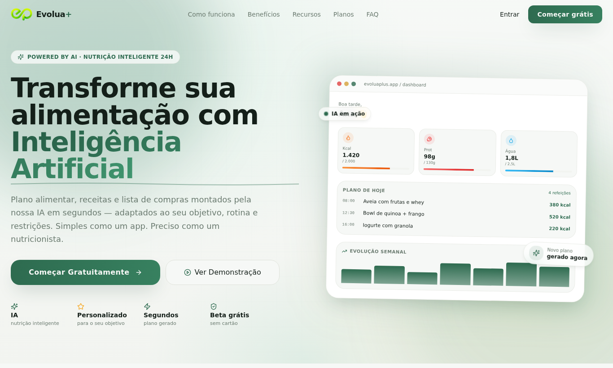

# Evolua Plus

Um app de nutrição que monta seu plano alimentar com IA em menos de dois minutos, respeitando seu objetivo, suas restrições e a sua rotina.



**No ar:** https://balanced-you-plan.vercel.app

## Por que eu fiz

Consulta com nutricionista é cara, e a maioria dos apps de dieta só conta calorias e te deixa sozinho na hora de decidir o que comer. Eu queria algo que fizesse o caminho inteiro: entender o que a pessoa quer, sugerir um cardápio que ela consiga seguir, trocar uma refeição quando não dá e mostrar a evolução ao longo das semanas.

É o meu projeto pessoal mais completo: tem autenticação, banco, funções de IA no servidor, PWA e empacotamento para Android e iOS. Construí com o Lovable e fui refinando o código e a publicação nas lojas.

## O que ele faz

- **Plano personalizado:** onboarding curto e um plano semanal gerado a partir das respostas.
- **Troca de refeição:** não gostou de um prato? A IA sugere outro com os mesmos macros.
- **Scanner:** foto do prato ou da geladeira vira estimativa de porção e ideias de receita.
- **Diário e evolução:** registro do que foi comido, metas de água e gráficos semanais.
- **Assistente:** chat de nutrição e um "caça-mitos" para as dúvidas do dia a dia.
- **App nativo:** o mesmo código roda como PWA e como app Android/iOS via Capacitor.

## Tecnologias

React, TypeScript, Vite, Tailwind CSS, shadcn/ui, TanStack Query, Supabase (Auth, Postgres e Edge Functions), Capacitor, Vitest. Deploy na Vercel.

## Rodando localmente

Precisa de Node 20+ e de um projeto no Supabase.

```bash
git clone https://github.com/miguelguiul1/Evolua-Plus.git
cd Evolua-Plus
npm install
cp .env.example .env   # preencha com a URL e a chave publicável do seu Supabase
npm run dev
```

Outros comandos úteis:

```bash
npm test            # testes com Vitest
npm run build       # build de produção
npm run android     # abre o projeto Android (depois de npm run build:app)
```

As migrations e as Edge Functions ficam em `supabase/`. O passo a passo de publicação nas lojas está em [`PUBLICACAO.md`](PUBLICACAO.md).

## Licença

[MIT](LICENSE)
